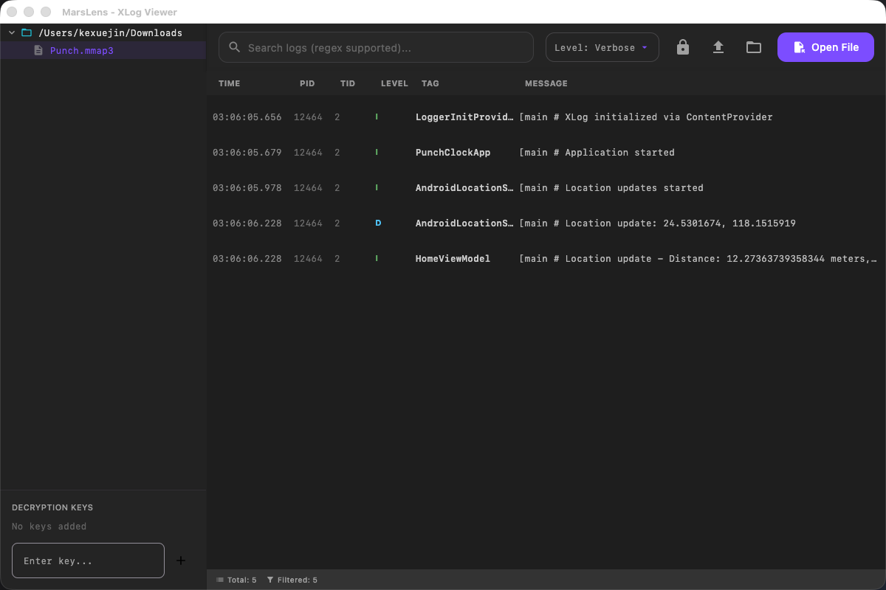

# MarsLens

[English](README.md) | [简体中文](README_CN.md)

**MarsLens** (原 XLog GUI) 是一个现代化、高性能的桌面应用程序，专为查看和分析腾讯 Mars XLog 文件而设计。项目采用 **Kotlin Compose Multiplatform** 构建 UI，底层集成 **Rust** 核心库，在 macOS 和 Windows 上提供原生级的体验，具备极速的日志解析和解密能力。



## ✨ 功能特性

*   **高性能解析**: 内置 Rust 核心引擎，解析和解密 `.xlog` 文件速度极快。
*   **跨平台支持**: 完美支持 macOS 和 Windows 桌面环境。
*   **现代化界面**: 采用 Material 3 设计语言，内置 "Deep Slate" 深色主题，视觉体验舒适。
*   **日志解密**: 支持使用私钥解析加密的日志文件。
*   **高级过滤**: 支持按日志级别（Verbose 到 Fatal）、标签、进程/线程 ID 进行过滤。
*   **强大搜索**: 支持正则表达式搜索，快速定位关键信息。
*   **文件树导航**: 集成侧边栏文件树，方便浏览和切换日志目录。
*   **导出功能**: 支持将过滤后的日志导出为标准文本格式。

## 🛠 技术栈

*   **UI 框架**: [Compose Multiplatform](https://www.jetbrains.com/lp/compose-multiplatform/) (Kotlin)
*   **核心引擎**: [Rust](https://www.rust-lang.org/) (通过 JNI 调用)
*   **依赖注入**: [Koin](https://insert-koin.io/)
*   **构建工具**: Gradle & Cargo

## 🚀 快速开始

### 环境要求

*   JDK 17 或更高版本
*   Rust (Cargo) 环境（用于编译核心库）

### 安装说明

**下载安装包**
请访问 [Releases](https://github.com/kexuejin/MarsLens/releases) 页面下载最新的 `.dmg` (macOS) 或 `.msi` (Windows) 安装包。

**源码编译**

1.  **克隆仓库**
    ```bash
    git clone https://github.com/kexuejin/MarsLens.git
    cd MarsLens
    ```

2.  **编译 Rust 核心库**
    ```bash
    make
    # 或者手动执行:
    # cd rust_core && cargo build --release && cp target/release/libxlog_core.dylib ../composeApp/libs/
    ```

3.  **运行应用**
    ```bash
    ./gradlew :composeApp:run
    ```

4.  **打包发布**
    ```bash
    ./gradlew :composeApp:packageDistributionForCurrentOS
    ```

## 📖 使用指南

1.  **打开日志**: 点击“打开文件”按钮或从左侧文件树选择文件。
2.  **解密日志**: 如果日志已加密，点击工具栏的锁形图标并输入私钥。
3.  **筛选日志**: 使用下拉菜单按日志级别筛选显示内容。
4.  **搜索内容**: 在搜索框输入关键词（支持正则）查找特定日志。

## 🤝 参与贡献

我们非常欢迎您的贡献！请查阅 [CONTRIBUTING.md](CONTRIBUTING.md) 了解如何提交 Pull Request、报告问题以及行为准则。

## 📄 许可证

本项目采用 MIT 许可证 - 详情请参阅 [LICENSE](LICENSE) 文件。
