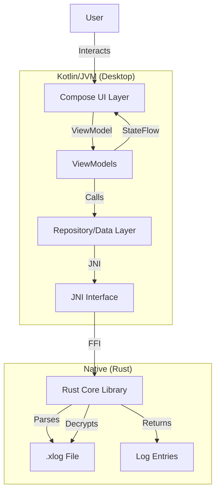
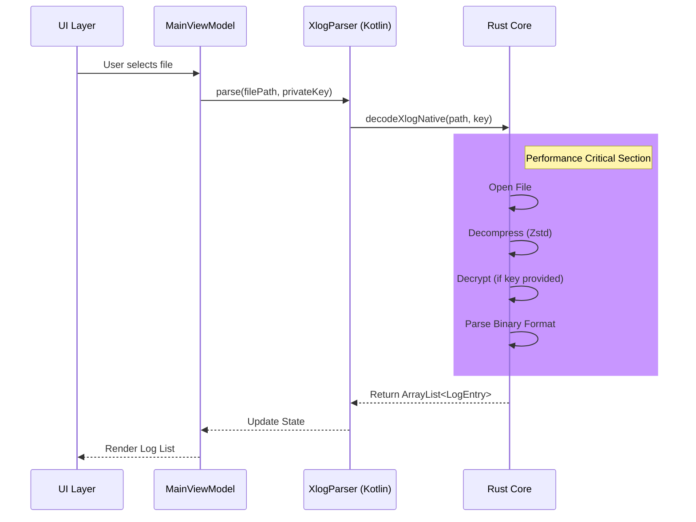

# System Architecture

## Overview

MarsLens is designed with a layered architecture, separating the high-performance native core from the modern reactive UI.

## Core Workflows

### 1. Log Parsing Flow

## Directory Structure

*   `composeApp/`: Kotlin Multiplatform code (UI, ViewModels, Data layer).
*   `rust_core/`: Rust library for low-level parsing and decryption.
*   `iosApp/`: iOS specific entry point (Future support).
*   `gradle/`: Build configuration and wrappers.

## Key Technologies

*   **UI**: Jetpack Compose (Multiplatform)
*   **State Management**: ViewModel + StateFlow
*   **Dependency Injection**: Koin
*   **Native Interop**: JNI (Java Native Interface)
*   **Build System**: Gradle (Kotlin) + Cargo (Rust)
